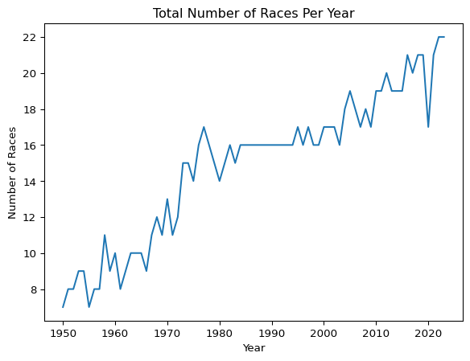
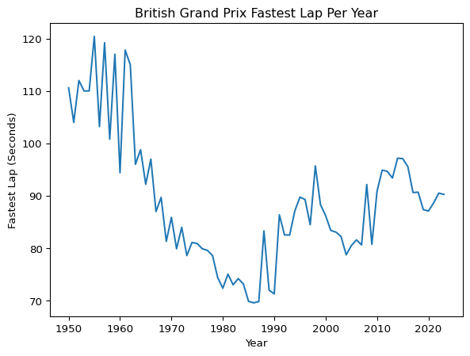
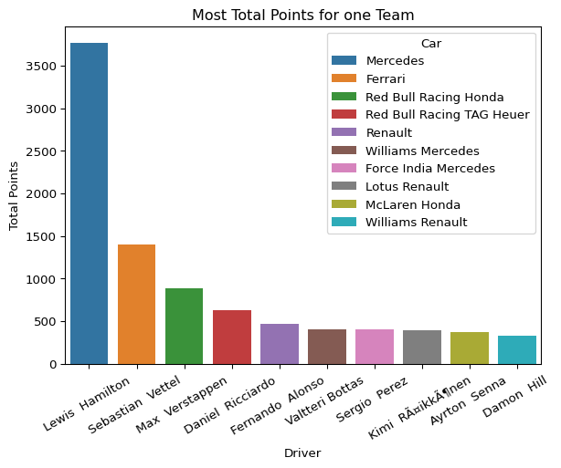
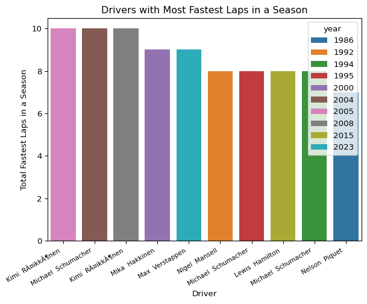
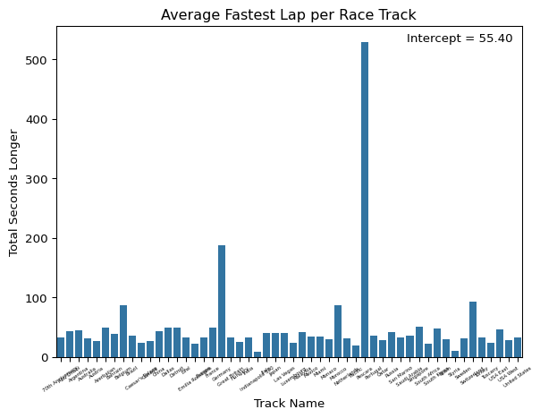

# Data Wrangling Final Project - F1 Data


## Purpose

The data I chose for this project is the F1 data on drivers, winners,
teams, and fastest laps for each season. This data starts in 1950 and
goes to about halfway through the 2024 season. The main reason I
undertook this project is that I was interested in exploring how F1 has
changed over the years, given that the cars and the racetracks
themselves can differ from year to year. I also chose F1 in particular
because, given the sport’s high popularity, I could easily validate my
findings by manually researching them. For example, if I found that a
particular driver won x races, I can easily verify that by Googling it.
This exploration is important because it can reveal various trends that
may not be readily apparent through a Google search. For example, the
evolution of the fastest lap at a particular track. While this can be
Googled, it’s much more impactful to explore it here and have a visual
for it.

Data for this project is linked
here(https://www.kaggle.com/datasets/lakshayjain611/f1-races-results-dataset-1950-to-2024?select=winners.csv)

``` python
import pandas as pd
import seaborn as sns
import matplotlib.pyplot as plt
import statsmodels.api as sm
import statsmodels.formula.api as smf
```

``` python
drivers = pd.read_csv('C:/Users/cbmch/OneDrive/Desktop/Data Wrangling Final Proj Code/drivers_updated.csv')
fastest_laps = pd.read_csv('C:/Users/cbmch/OneDrive/Desktop/Data Wrangling Final Proj Code/fastest_laps_updated.csv')
teams = pd.read_csv('C:/Users/cbmch/OneDrive/Desktop/Data Wrangling Final Proj Code/teams_updated.csv')
winners = pd.read_csv('C:/Users/cbmch/OneDrive/Desktop/Data Wrangling Final Proj Code/winners.csv')
```

``` python
drivers.head()
fastest_laps.head()
teams.head()
winners.head()
```


|  | Grand Prix | Date | Winner | Car | Laps | Time | Name Code |
|----|----|----|----|----|----|----|----|
| 0 | Great Britain | 1950-05-13 | Nino Farina | Alfa Romeo | 70.0 | 2:13:23.600 | FAR |
| 1 | Monaco | 1950-05-21 | Juan Manuel Fangio | Alfa Romeo | 100.0 | 3:13:18.700 | FAN |
| 2 | Indianapolis 500 | 1950-05-30 | Johnnie Parsons | Kurtis Kraft Offenhauser | 138.0 | 2:46:55.970 | PAR |
| 3 | Switzerland | 1950-06-04 | Nino Farina | Alfa Romeo | 42.0 | 2:02:53.700 | FAR |
| 4 | Belgium | 1950-06-18 | Juan Manuel Fangio | Alfa Romeo | 35.0 | 2:47:26.000 | FAN |


## Question 1: How was the total number of F1 Races changed over time?

The first question I asked my data was how the total number of F1 races
in a season changed over time. To do so, I first created a Dummy column
containing only the value ‘1’. I did this so I would have a numeric
column to sum when grouping. After this, I grouped by year and summed
the dummy column to get the total number of races in each year. Then I
dropped the most recent year, 2024, because the data covered only about
half the season. If this were included, a misleading race total for 2024
would result. Lastly, I plotted the total number using a line plot, with
year on the x-axis and the total number of races on the y-axis. I found
that the total number of races increased over the year. There are some
years with a few fewer races than the previous year, but overall, the
total trends up.

``` python
fastest_laps['Dummy'] = 1
race_per_year = fastest_laps.groupby('year').sum('Dummy')
race_per_year = race_per_year[0:74]

sns.lineplot(race_per_year, x = 'year', y = 'Dummy')
plt.xlabel('Year')
plt.ylabel('Number of Races')
plt.title('Total Number of Races Per Year')
plt.show()
```



## Question 2: How has the fastest lap at the British Grand Prix Changed over time?

Next, I wanted to explore how the fastest lap at a particular circuit
has evolved. I wanted to explore this to see whether lap times decreased
linearly over time or whether a different relationship held. To do this,
I first did value counts on the Grand Prix column of fastest laps to
determine which Grand Prix to look at. I selected the British Grand Prix
since it appeared the most, along with the Italian Grand Prix. I then
converted Time to total seconds. I did this becuase time was in MM:SS.MS
format, and it would be more valuable to look at the total time to
complete the race. To do this, I used pandas time delta functions.
Lastly, I plotted the seconds against years. This yielded an interesting
result. Instead of decreasing each year linearly, lap times got faster
until around 1990, then increased and stayed roughly the same until
modern day. There are a few explanations for this. First, the track was
renovated to make it more suitable for other racing series. The track
where the British Grand Prix is held wanted to sell more track books to
make more money. To do this, they increased the track length to
accommodate series such as MotoGP, which, in turn, made the F1 circuit
longer. The British Grand Prix circuit has been renovated a few times,
with the most recent significant change occurring in 2010, which is why
lap times have increased around this year. Next, new safety regulations
were introduced after Ayrton Senna’s death, drastically limiting track
speeds. Aryton Senna was a Brazilian F1 World Champion who tragically
died during the 1994 San Marino Grand Prix during a high speed corner.
After his death, F1 imposed new safety regulations, which forced teams
to redesign their cars and tracks, specifically the corners. This change
added things such as chicanes to more circuits, which led to decreased
track speed, which in turn led to increased track times.

``` python
fastest_laps['Grand Prix'].value_counts().head(10)
```

    Grand Prix
    Great Britain    74
    Italy            74
    Monaco           70
    Belgium          67
    Germany          64
    France           62
    Spain            53
    Canada           52
    Brazil           50
    United States    39
    Name: count, dtype: int64

``` python
fastest_lapsGB = fastest_laps[fastest_laps['Grand Prix'] == 'Great Britain'].copy()

fastest_lapsGB['Time_String'] = fastest_lapsGB['Time'].astype(str)
fastest_lapsGB['td'] = pd.to_timedelta('00:' + fastest_lapsGB['Time_String'])
fastest_lapsGB['Total_Seconds'] = fastest_lapsGB['td'].dt.total_seconds()
fastest_lapsGB.drop(columns= ['Time','Time_String','td'], inplace=True)
```

``` python
sns.lineplot(fastest_lapsGB, x = 'year', y = 'Total_Seconds')
plt.xlabel('Year')
plt.ylabel('Fastest Lap (Seconds)')
plt.title('British Grand Prix Fastest Lap Per Year')
plt.show()
```



## Question 3: What is each teams all time leading point scorer?

Next, I asked what each team’s leading point scorer was. To answer this
question, I first grouped my driver data by car and driver, and summed
each driver’s points to determine how many points each driver who has
raced for the team has earned. Next, I filtered my dataset to include
only drivers with over 100 points for that team, to remove drivers who
may have scored only a few points with that team. Next, I grouped my
dataset again to find the index of the highest point scorer for each
team. I then used this index to only include those index values in my
final dataframe. Lastly, I outputted my dataframe. What I noticed is
that the same driver shows up a few times for teams that have very
similar, but slightly different names. For example, Max Verstappen shows
up 3 times, all for Red Bull Racing, but with slightly different team
suffixes. This indicates that there are a lot of partnerships in F1 that
make it so that there are different teams that are really the same team
with a different name. For example, Max Verstappen has only raced for
Red Bull since 2016, indicating that the Team has changed its name 3
times.

``` python
drivers_grouped = drivers.groupby(['Car','Driver'])['PTS'].sum().reset_index()
drivers_grouped = drivers_grouped[drivers_grouped['PTS'] > 100]
idx = drivers_grouped.groupby('Car')['PTS'].idxmax()
top_drivers = drivers_grouped.loc[idx].reset_index(drop=True)
top_drivers_sorted = top_drivers.sort_values(by = 'PTS', ascending = False)
top_drivers_sorted
```

|     | Car                          | Driver             | PTS    |
|-----|------------------------------|--------------------|--------|
| 22  | Mercedes                     | Lewis Hamilton     | 3768.5 |
| 10  | Ferrari                      | Sebastian Vettel   | 1400.0 |
| 28  | Red Bull Racing Renault      | Sebastian Vettel   | 1237.0 |
| 19  | McLaren Mercedes             | Lewis Hamilton     | 913.0  |
| 25  | Red Bull Racing Honda        | Max Verstappen     | 887.5  |
| 26  | Red Bull Racing Honda RBPT   | Max Verstappen     | 744.0  |
| 29  | Red Bull Racing TAG Heuer    | Daniel Ricciardo   | 626.0  |
| 30  | Renault                      | Fernando Alonso    | 468.0  |
| 27  | Red Bull Racing RBPT         | Max Verstappen     | 454.0  |
| 39  | Williams Mercedes            | Valtteri Bottas    | 407.0  |
| 11  | Force India Mercedes         | Sergio Perez       | 400.0  |
| 16  | Lotus Renault                | Kimi Räikkönen   | 390.0  |
| 18  | McLaren Honda                | Ayrton Senna       | 374.0  |
| 23  | RBR Renault                  | Sebastian Vettel   | 340.0  |
| 40  | Williams Renault             | Damon Hill         | 326.0  |
| 21  | McLaren TAG                  | Alain Prost        | 262.5  |
| 2   | Aston Martin Aramco Mercedes | Fernando Alonso    | 239.0  |
| 1   | Alpine Renault               | Esteban Ocon       | 225.0  |
| 36  | Williams BMW                 | Juan Pablo Montoya | 221.0  |
| 35  | Tyrrell Ford                 | Jackie Stewart     | 203.0  |
| 20  | McLaren Renault              | Carlos Sainz       | 201.0  |
| 5   | Benetton Ford                | Michael Schumacher | 201.0  |
| 14  | Lotus Climax                 | Jim Clark          | 189.0  |
| 0   | AlphaTauri Honda             | Pierre Gasly       | 185.0  |
| 24  | Racing Point BWT Mercedes    | Sergio Perez       | 177.0  |
| 34  | Toyota                       | Jarno Trulli       | 175.5  |
| 17  | McLaren Ford                 | Denny Hulme        | 174.0  |
| 4   | BRM                          | Graham Hill        | 171.0  |
| 37  | Williams Ford                | Alan Jones         | 164.0  |
| 31  | Sauber BMW                   | Nick Heidfeld      | 163.0  |
| 38  | Williams Honda               | Nigel Mansell      | 162.0  |
| 15  | Lotus Ford                   | Mario Andretti     | 148.0  |
| 3   | BAR Honda                    | Jenson Button      | 139.0  |
| 7   | Brabham BMW                  | Nelson Piquet      | 129.0  |
| 9   | Cooper Climax                | Bruce McLaren      | 128.5  |
| 12  | Haas Ferrari                 | Kevin Magnussen    | 125.0  |
| 33  | Scuderia Toro Rosso Honda    | Pierre Gasly       | 124.0  |
| 32  | Sauber Ferrari               | Kamui Kobayashi    | 122.0  |
| 8   | Brabham Ford                 | Nelson Piquet      | 107.0  |
| 13  | Ligier Matra                 | Jacques Laffite    | 106.0  |
| 6   | Benetton Renault             | Michael Schumacher | 102.0  |


## Question 4: What are the all time point scorers for a single team?

Next, I wanted to view the top 10 point scorers for a single team. To do
this, I used the top drivers dataframe I just created and sorted it by
PTS to identify the highest-scoring driver. I then removed duplicate
values, so each driver appeared only once per team. I then made a bar
plot, with the bar color representing the driver’s team. What I found is
that most of the drivers on this list raced within the last 15 years.
This makes sense, as F1 revised its scoring rules in 2010. Prior to
2010, drivers who finished in the top 8 obtained points, with race
winners getting 10 points. After 2010, the top 10 drivers obtained
points, with the race winner getting 25 points. This means that a race
win post-2010 was worth 2.5 pre-2010 race wins. This, combined with the
fact that there are more races in F1 today than in previous years,
explains why more modern drivers appear on this graph.

``` python
top_drivers_top10 = top_drivers.sort_values(by = 'PTS',ascending=False)
top_drivers_unique = top_drivers_top10.drop_duplicates(subset='Driver', keep='first').reset_index(drop=True).head(10)

sns.barplot(top_drivers_unique, x = 'Driver',y = 'PTS', hue = 'Car')
plt.xlabel('Driver')
plt.ylabel('Total Points')
plt.title('Most Total Points for one Team')
plt.xticks(rotation = 30, fontsize = 10)
plt.show()
```



## Question 5: Which driver had the most fastest laps in a year?

Next, I wanted to know which drivers have had the fastest laps in a
year. To answer this, I first grouped my fastest-lap dataframe by year
and driver and summed the dummy column to count how many fastest laps
each driver had in that year. Next, I identified the driver with the
highest count for each year and created a new dataframe containing only
this driver. Then, I sorted the dataframe by the dummy column to get the
driver with the highest values to appear. Then, I turned the year into a
category so I could use it to color my bars when plotting. Next, I
created a variable named x to hold the driver’s order. I did this
because many drivers had a high number of fastest laps in a year. To
avoid them being grouped, I had to create a dummy variable to correctly
order them on the x-axis, then put the driver’s name on top of that
dummy variable. What I found is that Michael Schumacher falls in the top
10 3 times, while Kimi Raikkonen appears twice. Michael Schumacher’s is
fairly impressive, considering he has eight fastest laps in back-to-back
years. There are only two modern drivers on this list, Max Verstappen
and Lewis Hamilton, indicating that fastest_lap is not related to
modernity.

``` python
fastest_laps_driver = fastest_laps.groupby(['year','Driver'])['Dummy'].sum().reset_index()
fastest_laps_g = fastest_laps_driver.loc[fastest_laps_driver.groupby("year")["Dummy"].idxmax()]
fastest_laps_plot = fastest_laps_g.sort_values(by = 'Dummy',ascending=False).head(10)
fastest_laps_plot['year'] = fastest_laps_plot['year'].astype('category')

fastest_laps_plot['x'] = range(len(fastest_laps_plot))
```

``` python
sns.barplot(data=fastest_laps_plot,x='x',y='Dummy',hue='year',dodge=False)
plt.xticks(ticks=fastest_laps_plot['x'],labels=fastest_laps_plot['Driver'],rotation=30,ha='right', fontsize = 10)
plt.xlabel('Driver')
plt.ylabel('Total Fastest Laps in a Season')
plt.title('Drivers with Most Fastest Laps in a Season')
plt.show()
```



## Question 6: Which nationality has produced the most race winners?

Next, after looking at fastest laps and point totals, I was interested
in which nationality produced the most race winners. I wanted to see
which countries produced many race winners with few drivers, and which
had a lot of drivers but not many winners. To do this, I first created a
dummy column grouped by race winner and then summed it. I then merged
the grouped dataframe with my drivers dataset to obtain each driver’s
nationality. I then dropped unneeded columns and duplicate entries. I
then grouped my grouped dataframe by country and summed the dummy column
to get the total number of race winners for each country. Then, I wanted
to find the total number of drivers from each country. To find this
number, I grouped my drivers’ data by nationality and found the unique
number of drivers. I then merged this with my winner-grouped dataframe
to create a single dataframe containing the country, total race winners,
and total drivers. I then plotted my data as a grouped bar chart. What I
found is that Great Britain has one of the highest values of total
drivers, but by far the highest value of race wins. This makes sense, as
Great Britain has had numerous multi-time F1 world champions, including
Lewis Hamilton (7), Jackie Stewart (3), and Damon Hill (2). Germany
comes in second, mainly due to Michael Schumacher, with Brazil in third,
mainly due to the success of Aryton Senna. What is interesting to see is
that the U.S. has one of the highest values of total drivers, but falls
well below many other countries with a fraction of the drivers, in terms
of race winners. This indicates that many Americans successfully reach
F1, but once they get there, they do not achieve the same level of
success as before.

``` python
winners['Dummy'] = 1
winners_grouped = winners.groupby('Winner')['Dummy'].sum()
winners_grouped_m = pd.merge(winners_grouped, drivers, left_on = 'Winner', right_on = 'Driver',how = 'inner')

winners_grouped_m.drop(columns = ['Pos','Car','PTS','year','Code'], inplace= True)
winners_grouped_m.drop_duplicates(inplace= True)

winners_grouped_country = winners_grouped_m.groupby('Nationality')['Dummy'].sum()
drivers_by_country = drivers.groupby('Nationality')['Driver'].nunique()
winners_drivers_grouped = pd.merge(winners_grouped_country, drivers_by_country, on = 'Nationality', how = 'inner' ).reset_index()

plot_df = winners_drivers_grouped.set_index('Nationality')[['Driver','Dummy']]
plot_df= plot_df.sort_values(by = 'Dummy',ascending= False)
```

``` python
plot_df.plot(kind='bar', stacked = False)
plt.ylabel("Count")
plt.title("Drivers vs Winners by Nationality")
plt.legend(["Drivers", "Race Winners"])
plt.show()
```


## Question 7: How does fastest lap differ for each track?

My final question was how does the fastest lap differ for each track? I
wanted to see if any track ran significantly faster or slower than the
average track. To answer this, I fit a Linear Mixed-Effects model and
examined its coefficients. I used this model because my data had a
grouping structure. Before I could model, I had to preprocess my data.
First, I wanted to turn everything into total seconds. I initially ran
into an issue when doing this. I ran into an issue because
pd.to_timedelta expected all values to be in hh:mm:ss format. I had one
value not in this format, 55.404. To get this time to the correct
format, I just manually set any place where the time was equal to that
value to have a 0: in front of it. Other than this, I converted
everything to the same time as above. Next, I created my model, in which
the total seconds depend on the Grand Prix. Then, I pulled out my model
intercept and coefficients. Then, I cleaned up my coefficient names by
removing unnecessary formatting in Grand Prix names to produce a cleaner
graph. Lastly, I plotted my data on a bar plot. This graph shows how
various race tracks differ in terms of fastest lap. I found that two
race tracks had dramatically higher average fastest laps compared to the
other courses. These two tracks were the Pescara Grand Prix and the
German Grand Prix. The Pescara Grand Prix was held in Pescara, Italy,
and took place only once in 1957. This Grand Prix was held on a
15.894-mile circuit, compared to the average F1 track of 3.227, which
explains why its fastest lap time is so much higher than the others’.
When the track is almost 5 times the length of an average track, it
makes sense that the fastest lap would be a lot slower. The German Grand
Prix’s fastest lap is the same story. The German Grand Prix has been
held on two circuits historically: the 14.173-mile Nürburgring and the
7.5-mile Hockenheimring. Both of these circuits have been shortened in
the modern day, but have not been raced as much as the older circuits.
The fact that the older, longer circuits were raced on more pulls up the
average lap time. Most of the next slowest-fastest lap circuits suffered
the same fate: long track lengths that resulted in slower, faster laps.
Many of these tracks, still in use today, have been shortened to match
the length of other F1 races. Overall, this model shows that fastest
laps are more closely related to track length than to other factors.
Tracks of similar length should see similar fastest laps, regardless of
the number of turns or track layout.

``` python
fastest_laps = fastest_laps.dropna(subset=['Time']).copy()
fastest_laps['Time_String'] = fastest_laps['Time'].astype(str)
fastest_laps[fastest_laps['Time_String'] == "55.404"] = '0:55.404'
fastest_laps['td'] = pd.to_timedelta('00:' + fastest_laps['Time_String'])
fastest_laps['Total_Seconds'] = fastest_laps['td'].dt.total_seconds()
```

``` python
md = smf.mixedlm('Total_Seconds ~ Q("Grand Prix")', fastest_laps, groups = fastest_laps['Grand Prix']).fit()
print(md.summary())
```

                             Mixed Linear Model Regression Results
    =======================================================================================
    Model:                      MixedLM          Dependent Variable:          Total_Seconds
    No. Observations:           1107             Method:                      REML         
    No. Groups:                 53               Scale:                       3025.6299    
    Min. group size:            1                Log-Likelihood:              -5778.8599   
    Max. group size:            74               Converged:                   Yes          
    Mean group size:            20.9                                                       
    ---------------------------------------------------------------------------------------
                                         Coef.      Std.Err.     z   P>|z|  [0.025   0.975]
    ---------------------------------------------------------------------------------------
    Intercept                             55.404        77.790 0.712 0.476  -97.061 207.869
    Q("Grand Prix")[T.70th Anniversary]   33.047       110.011 0.300 0.764 -182.571 248.665
    Q("Grand Prix")[T.Abu Dhabi]          43.764        96.325 0.454 0.650 -145.031 232.558
    Q("Grand Prix")[T.Argentina]          44.749        96.063 0.466 0.641 -143.532 233.029
    Q("Grand Prix")[T.Australia]          30.834        95.690 0.322 0.747 -156.714 218.382
    Q("Grand Prix")[T.Austria]            27.603        95.713 0.288 0.773 -159.990 215.197
    Q("Grand Prix")[T.Azerbaijan]         48.845        97.883 0.499 0.618 -143.003 240.693
    Q("Grand Prix")[T.Bahrain]            39.626        96.063 0.412 0.680 -148.655 227.906
    Q("Grand Prix")[T.Belgium]            87.842        95.509 0.920 0.358  -99.353 275.037
    Q("Grand Prix")[T.Brazil]             35.765        95.590 0.374 0.708 -151.588 223.117
    Q("Grand Prix")[T.Caesar's Palace]    24.494       102.906 0.238 0.812 -177.199 226.186
    Q("Grand Prix")[T.Canada]             26.356        95.578 0.276 0.783 -160.973 213.684
    Q("Grand Prix")[T.China]              43.032        96.202 0.447 0.655 -145.521 231.585
    Q("Grand Prix")[T.Dallas]             49.949       110.011 0.454 0.650 -165.669 265.567
    Q("Grand Prix")[T.Detroit]            49.806        97.515 0.511 0.610 -141.319 240.932
    Q("Grand Prix")[T.Eifel]              32.735       110.011 0.298 0.766 -182.883 248.353
    Q("Grand Prix")[T.Emilia Romagna]     21.901        99.163 0.221 0.825 -172.455 216.257
    Q("Grand Prix")[T.Europe]             33.131        95.961 0.345 0.730 -154.949 221.210
    Q("Grand Prix")[T.France]             50.152        95.528 0.525 0.600 -137.080 237.385
    Q("Grand Prix")[T.Germany]           187.855        95.520 1.967 0.049    0.638 375.072
    Q("Grand Prix")[T.Great Britain]      33.614        95.487 0.352 0.725 -153.537 220.765
    Q("Grand Prix")[T.Hungary]            26.159        95.690 0.273 0.785 -161.389 213.708
    Q("Grand Prix")[T.India]              32.306       100.426 0.322 0.748 -164.526 229.138
    Q("Grand Prix")[T.Indianapolis 500]    8.469        96.848 0.087 0.930 -181.349 198.287
    Q("Grand Prix")[T.Italy]              40.069        95.487 0.420 0.675 -147.082 227.220
    Q("Grand Prix")[T.Japan]              41.265        95.690 0.431 0.666 -146.284 228.813
    Q("Grand Prix")[T.Las Vegas]          40.086       110.011 0.364 0.716 -175.532 255.704
    Q("Grand Prix")[T.Luxembourg]         24.224       102.906 0.235 0.814 -177.469 225.916
    Q("Grand Prix")[T.Malaysia]           42.543        96.105 0.443 0.658 -145.819 230.905
    Q("Grand Prix")[T.Mexico]             34.693        95.961 0.362 0.718 -153.386 222.772
    Q("Grand Prix")[T.Miami]              35.164       100.426 0.350 0.726 -161.668 231.996
    Q("Grand Prix")[T.Monaco]             30.534        95.499 0.320 0.749 -156.642 217.709
    Q("Grand Prix")[T.Morocco]            87.096       110.011 0.792 0.429 -128.522 302.714
    Q("Grand Prix")[T.Netherlands]        31.887        95.753 0.333 0.739 -155.785 219.559
    Q("Grand Prix")[T.Pacific]            19.795       102.906 0.192 0.847 -181.898 221.487
    Q("Grand Prix")[T.Pescara]           529.196       110.011 4.810 0.000  313.578 744.814
    Q("Grand Prix")[T.Portugal]           36.148        96.151 0.376 0.707 -152.305 224.600
    Q("Grand Prix")[T.Qatar]              28.354       102.906 0.276 0.783 -173.339 230.046
    Q("Grand Prix")[T.Russia]             42.469        97.237 0.437 0.662 -148.113 233.050
    Q("Grand Prix")[T.San Marino]         32.822        95.881 0.342 0.732 -155.102 220.747
    Q("Grand Prix")[T.Saudi Arabia]       36.073        99.163 0.364 0.716 -158.283 230.428
    Q("Grand Prix")[T.Singapore]          50.957        96.400 0.529 0.597 -137.984 239.898
    Q("Grand Prix")[T.South Africa]       23.202        95.961 0.242 0.809 -164.878 211.281
    Q("Grand Prix")[T.South Korea]        47.916        99.163 0.483 0.629 -146.440 242.272
    Q("Grand Prix")[T.Spain]              30.321        95.572 0.317 0.751 -156.997 217.638
    Q("Grand Prix")[T.Styria]             10.935       102.906 0.106 0.915 -190.758 212.627
    Q("Grand Prix")[T.Sweden]             31.616        97.883 0.323 0.747 -160.232 223.464
    Q("Grand Prix")[T.Switzerland]        92.976        97.883 0.950 0.342  -98.872 284.823
    Q("Grand Prix")[T.Turkey]             33.514        97.021 0.345 0.730 -156.644 223.672
    Q("Grand Prix")[T.Tuscany]            23.429       110.011 0.213 0.831 -192.189 239.047
    Q("Grand Prix")[T.USA East]           46.273        98.397 0.470 0.638 -146.582 239.128
    Q("Grand Prix")[T.USA West]           28.238        97.237 0.290 0.772 -162.344 218.820
    Q("Grand Prix")[T.United States]      33.136        95.679 0.346 0.729 -154.391 220.664
    Group Var                           3025.630 412707915.233                             
    =======================================================================================

``` python
intercept = md.params['Intercept']
coefficients = md.params
track_times = coefficients.to_frame().reset_index()
track_times = track_times[1:53]

track_times['clean_name'] = track_times['index'].str.replace(r'Q\("Grand Prix"\)\[T\.', '', regex=True).str.replace(r'\]', '', regex=True)
```

``` python
sns.barplot(x = 'clean_name',y = 0, data = track_times)
plt.annotate(f"Intercept = {intercept:.2f}",xy=(0.98, 0.98),xycoords='axes fraction',ha='right', va='top')
plt.ylabel('Total Seconds Longer')
plt.xlabel('Track Name')
plt.title('Average Fastest Lap per Race Track')
plt.xticks(rotation = 35, fontsize = 4)
plt.show()
```


